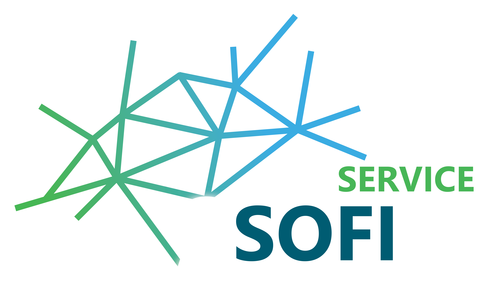

[)]()

# Sofi-Service

This service provides an API to start calculations with [SOFiSTiK](https://www.sofistik.de/) as well as to read out the result via HTTP-Requests. The Sofi-Service is based on [FastAPI](https://fastapi.tiangolo.com/) and uses [CDB Interfaces 2020](https://www.sofistik.de/documentation/2020/en/cdb_interfaces/index.html#) to operate with the database of SOFiSTiK.

# Prerequisites

* `python3.8` or `conda`
* `make` (optional)

Install the requirements with `make install-conda` or with `conda install --file requirements.txt`. Make sure that you are in the right virtual environment. If you want to create an environment for this project use `make conda-create-env`.

# Start
The easiest way to start the service is with `make up`. For this you need make installed.

# API-Docs
Since this project is using FastAPI, there are automatically created documentations for the API. If the server is running you can access the documentation here : `http://localhost:8001/docs`.

A current version of the OpenAPI can be found in the folder [OpenAPI](/openAPI/sofi-service.json).

# Testing
There is one really simple test which can be run with `make test`.

# Integration into Scope-Admin
You can integrate this service into the SCOPE-Service stack with the help of [SCOPE-Admin](https://github.com/projekt-scope/scope-admin) as an external service.

# Background
This service is part of the research project _Semantic Construction Project Engineering_ ([EnOB:SCOPE](https://www.projekt-scope.de/)) founded by the German Federal Ministry for Economic Affairs and Energy (BMWi).

# Contact
 [SCOPE](https://www.projekt-scope.de/)
